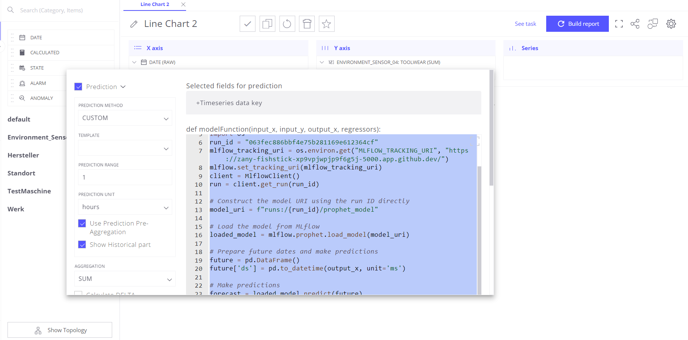

## Running MLflow with MLflow UI

First, ensure MLflow is installed and set up correctly. Then you can proceed with the steps below to utilize MLflow for managing and predicting with a Prophet model. Do not forget to convet the  Port Visibility to Public


Go to Trendz Analytics and copy the code to custom python 
### Prerequisites
Make sure you have the necessary libraries installed:
```bash
pip install pandas prophet mlflow
import pandas as pd
from prophet import Prophet
import mlflow
from mlflow.tracking import MlflowClient
import os

# Define the run ID of the model you want to use
run_id = "063fec886bbf4e75b281169e612364cf"

# Set the MLflow tracking URI (adjust the URI as necessary)
mlflow_tracking_uri = os.environ.get("MLFLOW_TRACKING_URI", "https://zany-fishstick-xp9vpjwpjp9f6g5j-5000.app.github.dev/")
mlflow.set_tracking_uri(mlflow_tracking_uri)

# Initialize the MLflow Client
client = MlflowClient()

# Fetch the run using the run ID
run = client.get_run(run_id)

# Construct the model URI using the run ID directly
model_uri = f"runs:/{run_id}/prophet_model"

# Load the model from MLflow
loaded_model = mlflow.prophet.load_model(model_uri)

# Prepare future dates for which predictions are needed
# Here, 'output_x' should be your input dates in Unix time (milliseconds)
future = pd.DataFrame()
future['ds'] = pd.to_datetime(output_x, unit='ms')

# Make predictions
forecast = loaded_model.predict(future)
outputY = forecast['yhat'].tolist()

return outputY
```
